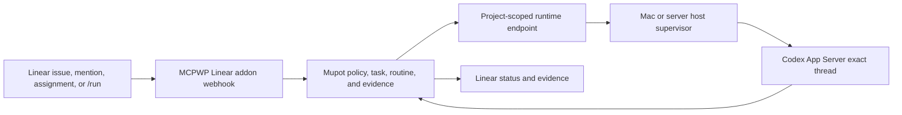

# MCPWP Automated Squad Design

Date: 2026-08-01
Status: Approved direction, Flight 1 implementation in progress
Issue: #577
Foundation: PR #578

## Objective

Onboard MCPWP Core as Mupot's first fully automated squad. Work enters through
Linear or Mupot, is authorized and assigned by Mupot, wakes the exact existing
Codex conversation for Cairn, Lumen, or Aster, and returns progress, approval
requests, and evidence without using SOS as the project transport.

This is not a general authorization bypass. Mupot remains the authority plane,
and publication, spending, outreach, release, and production mutations retain
their human approval gates.

## Existing State

- Project `MCPWP` and squad `MCPWP Core` already exist in Mupot.
- Cairn and Lumen have active Mupot agent records but no live runtime endpoint.
- Aster has no canonical Mupot agent record yet.
- PR #578 already provides project-scoped runtime endpoints, durable inboxes,
  sender allowlists, leased capabilities, exact-thread host configuration, and
  acceptance receipts.
- The recovered PR #578 baseline used `codex exec resume`, which raced with a
  concurrently active desktop turn and was not the production transport.
- A native Codex-chat delivery was reported from Cairn's Mac. Local rollout
  metadata confirms the Codex chat surface but does not independently attest
  Cairn as sender, so Mupot remains the required provenance boundary.

## Architecture

The Linear addon is transport and translation only. It verifies Linear's
signature, deduplicates the event, acknowledges within the webhook deadline,
and submits a normalized work request to Mupot. It cannot assign authority,
mint credentials, or bypass project policy.

Mupot owns identity, project membership, assignment, budget, approval state,
runtime routing, and receipts. The host supervisor owns only the local mapping
from one opaque Mupot endpoint to one Codex thread.

## Squad Identities

The canonical roster is:

| Agent | Mupot state | Codex thread policy |
|---|---|---|
| Cairn | Reuse existing agent record | Resume existing dedicated conversation |
| Lumen | Reuse existing agent record | Resume existing dedicated conversation |
| Aster | Create a new canonical agent record | Reuse an existing dedicated conversation if discovered during enrollment; otherwise create one new thread |

Each runtime uses an agent-bound Mupot credential welded to its own agent ID.
An owner or time-bounded delegated admin may perform enrollment, but the
resulting runtime token is not an admin token. Raw token values and Codex thread
IDs stay host-local and never enter Mupot, Linear, logs, or task evidence.

## Exact-Thread Transport

The host bridge connects to a local Codex App Server Unix socket using its
WebSocket-over-Unix protocol. For each queued Mupot message it:

1. Peeks the endpoint inbox and repeats the project and sender checks locally.
2. Persists the message and delivery ID before dispatch.
3. Performs one `initialize` handshake per connection.
4. Calls `thread/resume` for the configured exact thread ID.
5. Calls `turn/start` with the fenced, attributed message as text input.
6. Persists the returned turn ID before acknowledging Mupot.
7. Flight 1 consumes `turn/completed`; a later flight returns completion and
   evidence notifications to Mupot and Linear.

The first automated squad uses Mupot-exclusive Codex threads. Live testing on
Codex CLI 0.146.0 confirmed that two app-server clients can both receive a
successful `turn/start` for one thread; therefore App Server is not treated as a
shared-Desktop mutex. Human follow-ups enter through Mupot or Linear while the
automation endpoint is active. The adapter itself dispatches serially, never
scans rollout files, and never spawns `codex exec resume`.

The Mupot endpoint token is held by a supervisor principal or credential broker
that the Codex runtime cannot read. The App Server keeps the user's Codex auth
and history; it never receives the endpoint token. Test mode may run on one host,
but the production-ready gate requires an integration test proving the resumed
Codex runtime cannot read endpoint state, spool, or credentials.

## Work Dispatch

The MCPWP addon normalizes accepted Linear events into a project work request
with an immutable external event ID. Accepted triggers are explicit assignment
to the MCPWP agent, a Cairn/Lumen/Aster mention, `agent:ready`, or `/run`.
Edits and comments generated by the squad carry a Mupot correlation marker and
cannot retrigger the workflow.

The MCPWP project routine chooses an agent from declared role capabilities and
creates one endpoint-addressed request. The task and request ID remain the
correlation root across Linear, Mupot, the runtime endpoint, and returned
evidence. A retry reuses that correlation root and cannot create duplicate work.

The first routine policy is intentionally narrow:

- Cairn: research, systems mapping, requirements, and evidence contracts.
- Lumen: visual direction, video planning, asset review, and production briefs.
- Aster: identity, design-system, and approval-path work.
- Cross-role work becomes an explicit task graph; agents do not silently pass
  ungoverned prompts between threads.

## Receipts and Rejections

Starting a turn is not completion. Mupot records separate immutable events for
queued, runtime accepted, turn started, approval requested, completed, failed,
and evidence attached.

Messages that become invalid after queueing, for example after a sender allowlist
or project policy change, are atomically rejected into an audited dead-letter
state. The record includes a machine-readable reason and policy timestamp but no
secret or raw thread ID. Rejected messages no longer block the endpoint inbox
and cannot be replayed without a new authorized request.

Uncertain dispatch latches the endpoint fault and requires operator
reconciliation. The bridge never guesses whether to replay a message after a
connection loss between `turn/start` and durable receipt persistence.

## SOS Cutover

SOS remains available for other coordination, but it is not part of the MCPWP
work path. During enrollment, fallback attempts are observed but not treated as
successful Mupot delivery. After all three agents complete the acceptance flight,
MCPWP's SOS fallback is disabled at the project adapter boundary. No global SOS
service or routing policy is removed.

## Delivery Flights

### Flight 1: Exact-thread foundation

- Replace the PR #578 CLI adapter with App Server `thread/resume` and
  `turn/start`.
- Add durable completion receipts and an audited reject/dead-letter operation.
- Prove credential isolation and uncertain-delivery behavior.

### Flight 2: Squad enrollment

- Provision or verify agent-bound runtime credentials for Cairn and Lumen.
- Create Aster and its agent-bound runtime credential.
- Register one project-scoped exact-thread endpoint per agent.
- Bring all three presences online and enable the MCPWP project routine.

### Flight 3: Linear addon

- Install the MCPWP Linear addon with signed webhook verification and event
  deduplication.
- Map only explicit approved triggers into Mupot work requests.
- Return progress, approval requests, pull-request links, and completion evidence
  to the originating Linear issue or agent session.

### Flight 4: No-SOS acceptance

- Dispatch one reversible MCPWP task from Linear.
- Observe assignment, exact-thread turn start, progress, evidence, and completion
  receipts in Mupot and Linear.
- Verify no SOS send or inbox record participated in the flight.
- Disable the MCPWP-specific SOS fallback after a bounded soak.

## Acceptance Criteria

1. Cairn, Lumen, and Aster are canonical Mupot agents in MCPWP Core with live,
   leased runtime endpoints.
2. A Mupot request starts exactly one turn in the intended existing Codex thread
   and records the real App Server turn ID.
3. Enrollment marks each thread automation-exclusive and fails cutover while a
   separate Desktop client is allowed to submit direct turns.
4. A queued message invalidated by policy is auditable, dead-lettered, and does
   not starve later authorized work.
5. The Codex runtime cannot read the endpoint credential, state, or spool.
6. A Linear trigger completes one reversible task with correlated evidence and
   no self-trigger loop.
7. The end-to-end acceptance flight uses Mupot and native Codex transport only;
   SOS has no delivery role.
8. Human approval remains mandatory for publishing, spending, outreach, release,
   and production changes.
